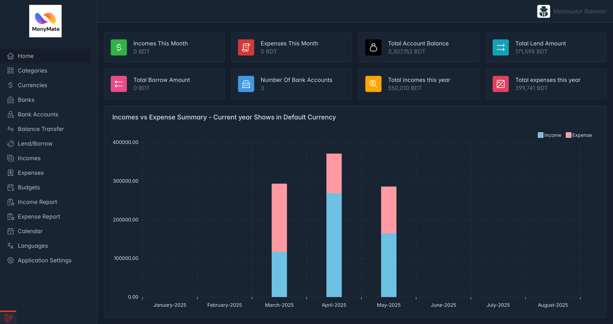

````markdown
# 💰 MoneyMate – Personal Finance Tracker

**MoneyMate** is a modern, open-source financial tracker  
built with Laravel 12.

It empowers you to manage your personal finances efficiently  
by tracking incomes, expenses, budgets, and more—  
all from a beautiful, user-friendly interface.


---

## 🚀 Features

- **Home Dashboard**
- **Categories** – Organize your transactions
- **Currencies** – Multi-currency support
- **Banks** – Manage multiple banks
- **Bank Accounts** – Track balances across accounts
- **Balance Transfer** – Seamlessly transfer funds
- **Lend/Borrow** – Record loans and borrowings
- **Incomes** – Log and categorize income
- **Expenses** – Record and categorize spending
- **Budgets** – Set monthly or custom budgets
- **Income Report** – Visualize and analyze income sources
- **Expense Report** – Get detailed breakdowns of spending
- **Calendar** – Timeline view of your transactions
- **Languages** – Multilingual interface support
- **Application Settings** – Fully customizable

---

## 🛠 Requirements

- **PHP**: 8.3 or higher
- **Composer**: 2.x
- **MySQL**: 8.x or compatible database
- **Node.js & NPM**: For compiling front-end assets (if needed)
- **Web Server**: Apache/Nginx or Laravel Valet

---

## ⚡️ Quick Start

### 1. Clone the Repository

```bash
git clone https://github.com/Shibly/moneymate.git
cd moneymate
````

### 2. Install PHP Dependencies

```bash
composer install
```

### 3. Set Up Environment

Copy `.env.example` to `.env` and update database credentials:

```bash
cp .env.example .env
```

### 4. Generate Application Key

```bash
php artisan key:generate
```

### 5. Set Permissions (Linux/macOS)

```bash
chmod -R 775 storage bootstrap/cache
```

### 6. Configure Virtual Host

* Create a new virtual host (e.g., `moneymate.test`) and point it to the `public` directory.
* Or use Laravel Valet:

  ```bash
  valet link moneymate
  valet secure moneymate
  open https://moneymate.test
  ```

### 7. Run the Installer

Navigate to your site (e.g., `http://moneymate.test`) and follow the **installation wizard** to complete setup.

### 8. Default Login

After install, you can log in with the default admin credentials:

* **Email:** `admin@gmail.com`
* **Password:** `12345678`

> *Please change your password after first login for security.*

---

## 📸 Screenshots



---

## 🤝 Contributing

PRs and issues are welcome! Feel free to fork and enhance MoneyMate.

---

## 📄 License

MIT License.

---

### *Happy Tracking with MoneyMate!*

```


